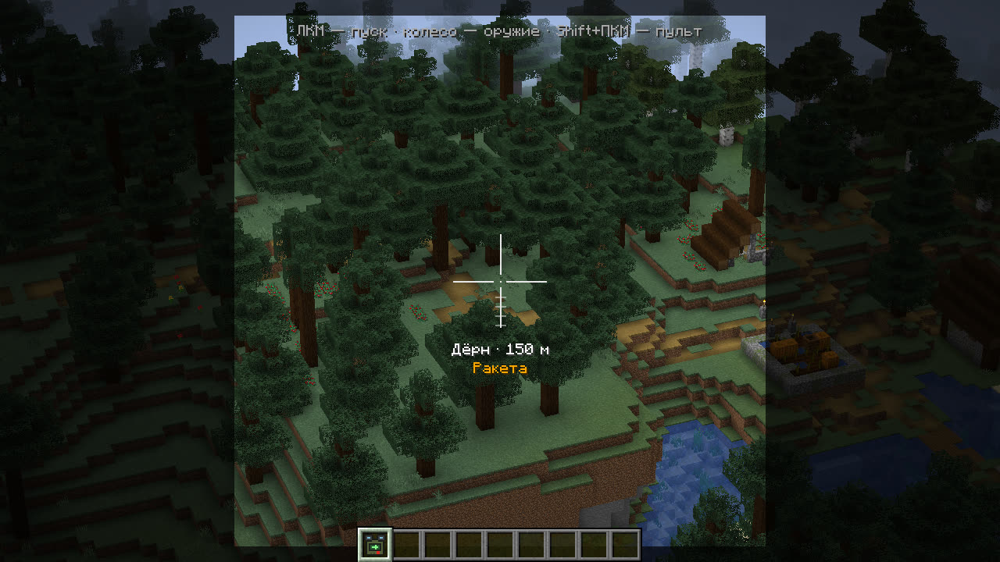

# Airstrike: руководство игрока

Airstrike добавляет удары с воздуха: шахеды, барражирующие «Ланцеты», крылатые ракеты, залпы «Града», бомбардировщик
B-2 с бетонобойной бомбой и межконтинентальную ракету с ядерной боевой частью. Всё наводится одним предметом,
пультом наведения. От ударов защищает зенитный ракетный комплекс.

Блок равен метру: снаряды в настоящую величину, скорости и радиусы близки к настоящим (ракета медленнее, чтобы
подлёт было видно). Снаряд летит по-настоящему, его видно и слышно издалека, а у цели заранее воет сирена.

## С чего начать

1. Скрафти [пульт наведения](designator.md#как-получить): подзорная труба в центре, по бокам железо, сверху красная
   пыль, снизу компас.
2. Скрафти [боеприпасы](munitions.md). Пульт стреляет только тем, что лежит в инвентаре: на один шахед нужен
   один предмет «Шахед-136».
3. Возьми пульт и держи ПКМ: откроется бинокль. Колесом мыши выбери оружие, наведи прицел и нажми ЛКМ.
4. Нажми `N`, чтобы смотреть камерой снаряда: пуск, полёт и попадание. Выйти из камеры — Shift.
5. Shift+ПКМ открывает экран пульта: залп, разброс, режим цели. Клавиша `,` открывает карту для ударов
   по дальним местам.

## Разделы

| Раздел | Что там |
|---|---|
| [Пульт наведения](designator.md) | бинокль, экран пульта, режимы цели, снаряды на экране, отбой |
| [Карта наведения](map.md) | удар по месту до 10 км, выбор игрока на карте, маршрут полёта |
| [Камера снаряда](camera.md) | вид с борта, перенацеливание, выбор цели для «Ланцета» |
| [Оружие](weapons.md) | чем отличается каждое оружие и когда что брать |
| [Боеприпасы и крафт](munitions.md) | рецепты, оплата пуска, возврат |
| [Правила ударов](rules.md) | по кому можно бить, разведка, свои по команде, точность |
| [Оборона](defense.md) | сирены, укрытия, зенитный ракетный комплекс |
| [Ядерный удар](nuke.md) | пуск, второй ключ, что делает взрыв, как выжить, радиация |
| [Блэкаут](blackout.md) | подстанция и отключение света |
| [Команды](commands.md) | `/airstrike` и примеры |
| [Настройки и клавиши](settings.md) | свои настройки, клавиши, настройки мира |
| [Вопросы и неполадки](faq.md) | что значат сообщения и что делать |

## Клавиши

| Где | Клавиша | Что делает |
|---|---|---|
| с пультом в руке | ПКМ (держать) | бинокль |
| в бинокле | ЛКМ | пуск по цели под прицелом |
| в бинокле | колесо мыши | выбор оружия |
| с пультом в руке | Shift+ПКМ | экран пульта |
| в игре | `,` | карта наведения |
| в игре | `N` | камера снаряда; ещё раз — следующий снаряд |
| в камере снаряда | ЛКМ, Shift, F5 | новая цель, выход, вид со стороны |
| на карте | ЛКМ, Enter | выбрать цель, огонь |
| на карте | Shift+ЛКМ, ПКМ | поставить и убрать точку маршрута |
| рядом с чужим ядерным пуском | `.` | второй ключ |

Клавиши меняются в «Настройки → Управление → Airstrike».
