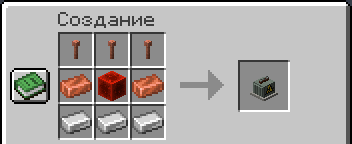

# Блэкаут

Трансформаторная подстанция питает электричеством район радиусом 512 блоков. Если её выбить взрывом, электрические
лампы района гаснут по кварталам, волной от подстанции. Через 15 минут свет возвращается.

## Подстанция

Крафт: сверху три громоотвода; в середине медный слиток, блок красного камня и медный слиток; снизу три железных
слитка.

Поставь её в городе или на базе. Она гудит, а при попадании искрит и выходит из строя.

## Что гаснет

- Гаснут светильники «от сети»: светокамень, морской фонарь, фонарь и фонарь душ, лампа из красного камня, медные
  лампы, грибосвет, жабосветы, стержень Энда.
- Факелы, свечи и костры горят дальше.
- Ядерный удар обесточивает весь свой радиус, даже без подстанции.

Свет возвращается сам, вразнобой по кварталам. Оператор может вернуть его сразу командой `/airstrike grid restore`.

## Если мод удалят

Мир сохраняется с обычными лампами, поэтому открывается и без мода. Исключение — механизмы Create, собранные
в тёмном квартале: их лампы остаются погашенными, пока механизм не разобран. Перед удалением мода такие механизмы
лучше разобрать.
