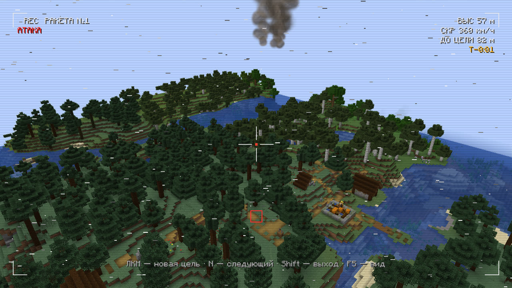
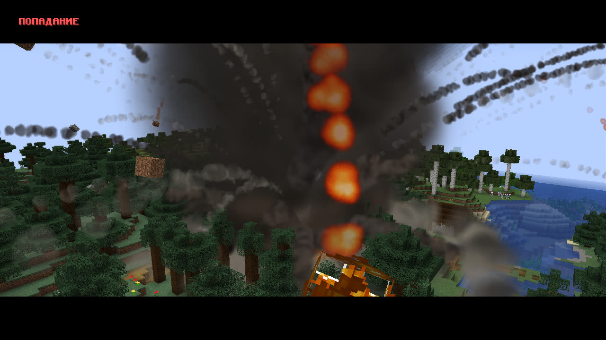
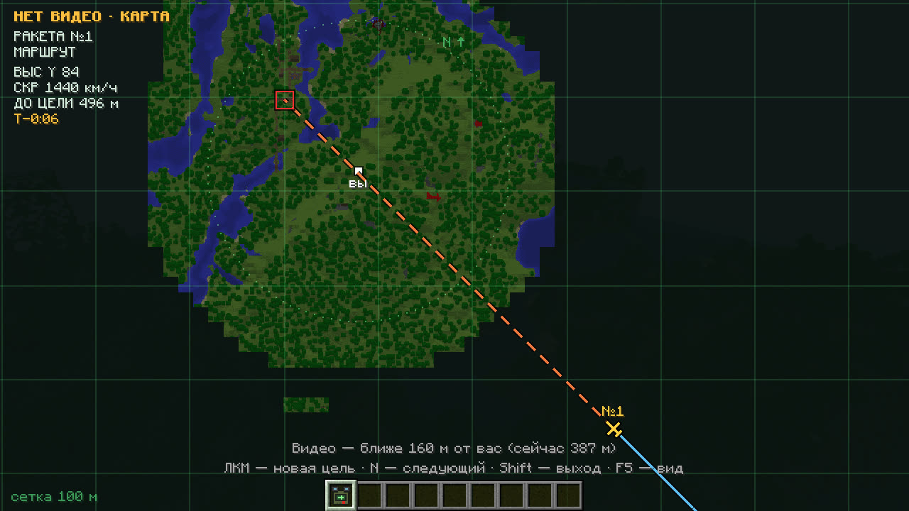
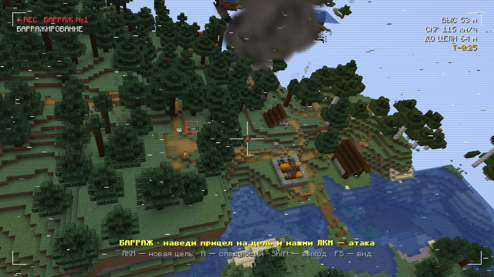

# Камера снаряда

Камера показывает удар глазами снаряда. Нажми `N`, когда твой снаряд в полёте: камера включится на том, что ударит
раньше всех. Ещё раз `N` — следующий снаряд, после последнего — обратно к себе. Shift — выход.

Пока ты смотришь камерой, твой персонаж стоит на месте, а что творится вокруг него, ты не видишь.

## Три плана

1. **Пуск.** Пока снаряд на пусковой и на ускорителе, камера стоит сбоку и ведёт его.
2. **Борт.** После отделения ускорителя — вид с борта: высота, скорость и расстояние до цели («ВЫС», «СКР»,
   «ДО ЦЕЛИ»). Мышью можно осмотреться, F5 — вид со стороны.
3. **Попадание.** Помехи «СИГНАЛ ПОТЕРЯН», затем камера облетает взрыв. Дальше — следующий снаряд залпа или
   возврат к себе.

Если снаряд дальше твоей прорисовки, видео нет: вместо него карта с путём снаряда, курсом и целью («НЕТ ВИДЕО ·
КАРТА») и строка, с какого расстояния включится видео. Подлетит ближе — видео включится само.

Чтобы камера включалась сама при каждом пуске, включи в настройках «Камера снаряда сама при пуске».

## Перенацелить снаряд

ЛКМ в камере — новая цель: то, что сейчас в перекрестии. Так можно поправить удар на подлёте или перевести его
на другую постройку.

## Движущаяся цель

За движущимся игроком, мобом или аппаратом идут только шахед и «Ланцет», и только пока ты держишь цель в кадре их
камеры. Внизу кадра написано, что происходит:

- «ЦЕЛЬ В КАДРЕ · ВЕДУ» — снаряд идёт за целью;
- «ЦЕЛЬ ВНЕ КАДРА · ЛЕЧУ ТУДА, ГДЕ ВИДЕЛ» — снаряд летит к месту, где цель была видна последний раз.

Остальное оружие бьёт туда, где цель была в момент приказа.

## «Ланцет»: выбор цели

«Ланцет» прилетает к цели и кружит над ней. В его камере написано «БАРРАЖ · наведи прицел на цель и нажми ЛКМ —
атака». Наведи прицел на то, что видно внизу, и нажми ЛКМ: он сразу пикирует. Если новая цель дальше 140 блоков,
он сначала летит к ней и кружит уже там. Если цель не выбрать, «Ланцет» пикирует сам через 25 секунд.

