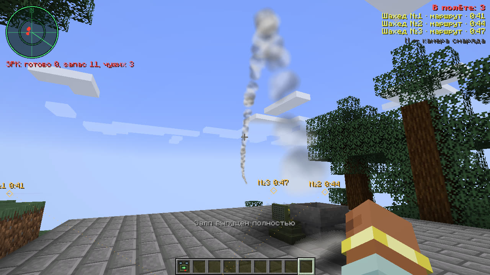
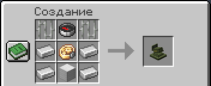
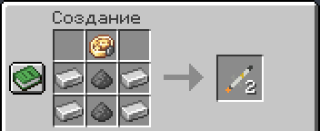

# Оборона

## Сирены

Снаряд «замечают» на подлёте: у всех, кто ближе 350 блоков к цели, заранее воет сирена и на экране появляется
надпись. О ядерном ударе предупреждают всех в 20 км.

| Сирена | Оружие | За сколько до удара |
|---|---|---|
| ⚠ ВОЗДУШНАЯ ТРЕВОГА ⚠ | шахед, «Ланцет», B-2 | 25, 20 и 20 секунд |
| ⚠ РАКЕТНАЯ ОПАСНОСТЬ ⚠ | крылатая ракета, «Град» | 15 и 8 секунд |
| ☢ РАКЕТНОЕ НАПАДЕНИЕ ☢ | МБР | 90 секунд, с обратным отсчётом |

Услышал сирену — уходи под землю или от построек, которые могут быть целью. Снаряды слышно и издалека: мопедный гул
шахеда, жужжание «Ланцета», вой ракеты, рёв «Града». Звук приходит с задержкой на скорость звука, так что вспышку
вдали видно раньше, чем слышно взрыв. Снаряды, вспышки и столбы дыма видно и слышно дальше прорисовки, до 8 км.

## Что делает взрыв

Взрыв ломает блоки, поджигает и разбрасывает обломки. Обломки летят далеко и могут убить. Ударная волна выбивает
окна далеко от места удара, у ракеты до 150 блоков. Из сломанных блоков выпадает часть, как у взрыва крипера: чем
сильнее взрыв, тем меньше.

Взрыв не разбирает своих и чужих: в радиусе достаётся всем, и тебе тоже.

## Укрытие

- **Земля и толстые стены.** От взрыва защищают грунт и толстые стены. Окна волна выбивает только там, куда
  подходит воздух с улицы: под землёй и под водой стёкла целы. Глубокий бункер в скале держит всё, кроме
  бетонобойной бомбы.
- **Бетонобойная бомба** пробивает около 30 блоков камня и взрывается внутри, а ударная волна под землёй убивает.
  От неё спасает только глубина больше её пробития или то, что её собьют вместе с B-2.
- **Ядерный удар** — отдельный разговор: [как выжить](nuke.md#как-выжить).

## Зенитный ракетный комплекс (ЗРК)

ЗРК — блок, который сам сбивает чужие шахеды, крылатые ракеты, «Ланцеты» и B-2. Свои для него — тот, кто его
поставил, и его команда (`/team`): их снаряды он не трогает.

Как он работает:

- Радар видит снаряды мода на 3 км. Малозаметные ближе: крылатую ракету примерно на 2 км, «Ланцет» на 1,5 км, B-2
  меньше чем на полкилометра.
- Огонь ЗРК ведёт с 1,5 км, по одной зенитной ракете на цель. Сбитая цель падает обломками, её боевая часть
  не взрывается.
- Примерно одна ракета из пяти промахивается, и цель летит дальше, пока по ней не пустят следующую.
- МБР и снаряды «Града» радар видит, но не сбивает. Игроков, мобов и летательные аппараты ЗРК не видит.
- На направляющих стоят 4 ракеты, следующая встаёт из запаса за 8 секунд.
- Под крышей ЗРК не стреляет: над ним должно быть открытое небо.
- Работает, только пока загружен его чанк: рядом должен быть игрок.

Когда радар видит новую чужую цель, всем своим в этом мире приходит строка «Воздушная тревога!» с тем, что летит,
направлением и расстоянием. Рядом с ЗРК (до 48 блоков) в левом верхнем углу экрана виден экран радара: круг дальности
радара, внутри круг огня, бегущий луч, чужие цели красным, те, за которыми уже идёт ракета, оранжевым, свои зелёным,
а под кругом — сколько ракет готово и в запасе. Цели радара видны и на [карте пульта](map.md).

ПКМ пустой рукой по ЗРК показывает его состояние: ракеты на направляющих и в запасе, сколько целей на радаре.

### Крафт и зарядка

ЗРК: сверху железная решётка, компас и железная решётка; в середине железный слиток, точный механизм Create (без
Create — часы) и железный слиток; снизу железный слиток, блок железа и железный слиток.

Зенитные ракеты, по две за крафт: сверху в центре точный механизм (без Create — компаратор), ниже два ряда
«железный слиток, порох, железный слиток».

Ракеты кладут в ЗРК правым кликом с ракетами в руке, воронкой или воронкой Create, так что его можно заряжать
с завода. Вынуть ракеты обратно нельзя. Сломанный ЗРК выпадает предметом вместе со всеми ракетами; взорванный
обычно разрушается, а ракеты из него выпадают.

Против обороны помогают залп (ЗРК пускает по ракете на цель, а направляющих всего четыре), маршрут в обход
радара, малозаметный B-2 и «Град», который ЗРК не сбивает.
