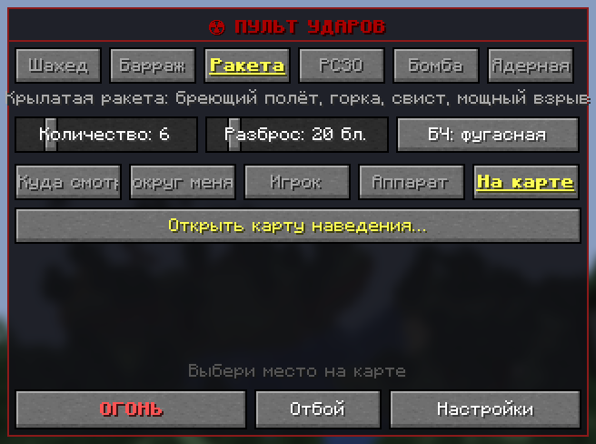
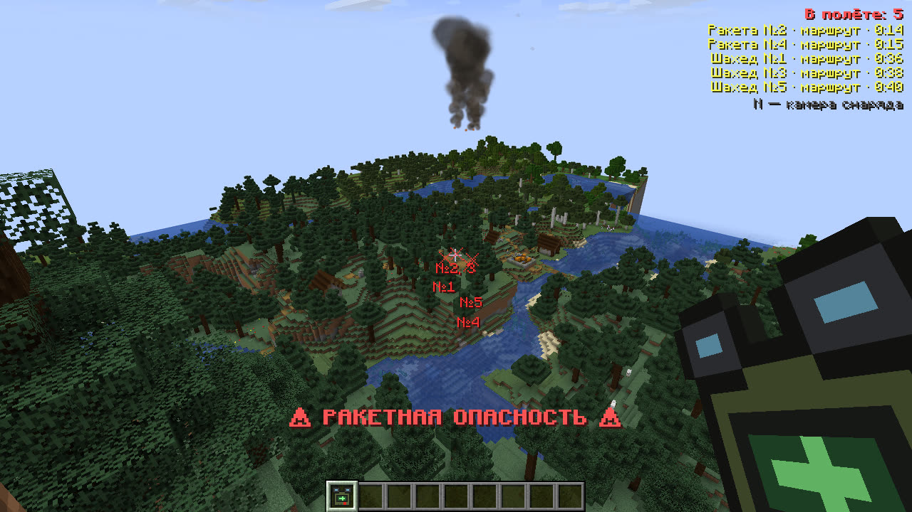

# Пульт наведения

Пульт наводит и пускает все удары мода: из бинокля, с экрана пульта или с [карты](map.md).

## Как получить

Крафт на верстаке: сверху красная пыль, в середине железный слиток, подзорная труба и железный слиток, снизу компас.

В творческом режиме пульт лежит во вкладке «Airstrike». Оператор выдаёт его командой `/airstrike give [игроки]`.
Пульт работает у всех игроков, если в мире включена настройка `designator_for_everyone` (так по умолчанию), иначе
только у операторов.

## Бинокль

Держи ПКМ с пультом в руке. Картинка приближается в 4 раза (кратность меняется в настройках), в центре прицельная
марка, под ней расстояние и то, что под прицелом: блок, моб, игрок или летательный аппарат Create. Когда под прицел
попадает моб, игрок или аппарат, пульт коротко пищит: цель захвачена.

- **ЛКМ** — пуск по тому, что под прицелом.
- **Колесо мыши** — выбор оружия: Шахед, Барраж, Ракета, РСЗО, Бомба, Ядерная.
- Внизу видно выбранное оружие, число снарядов и разброс залпа.

Прицел достаёт на 400 блоков. Дальше бей [по карте](map.md).

Сколько снарядов пустить и как широко их раскидать, задаёт экран пульта. Ядерный пуск идёт после 3 секунд
отсчёта, повторный ЛКМ его отменяет.

## Экран пульта

Shift+ПКМ с пультом в руке или команда `/airstrike menu`. Пульт запоминает всё, что выбрано на экране, и бинокль
стреляет с этими же настройками.

Сверху вниз:

1. **Оружие.** Шесть кнопок, у каждой подсказка при наведении мыши. Подробно — в разделе [Оружие](weapons.md).
2. **Количество и разброс.** Сколько снарядов в залпе (от 1 до 30) и на какой площади они лягут (от 0 до 150 блоков
   от центра). У ракеты и бомбы рядом кнопка боевой части: фугасная или ядерная. У оружия «Ядерная» вместо ползунков
   мощность (1 или 15 кт) и подрыв (воздушный или наземный).
3. **Цель.** Пять режимов:
   - **Куда смотрю** — точка, куда ты смотришь, как в бинокле.
   - **Вокруг меня** — место, где ты стоишь в момент пуска. Снаряды прилетят к тебе, так что отойди.
   - **Игрок** — список замеченных чужих игроков. Кого можно выбрать, решает [разведка](rules.md#разведка).
   - **Аппарат** — летательные аппараты Create Aeronautics ближе 600 блоков, ближние первыми.
   - **На карте** — место, выбранное на карте наведения. Кнопка «Открыть карту наведения…» открывает её.
4. **ОГОНЬ** — пуск по выбранной цели. **Отбой** — отменить свои удары (ниже). **Настройки** — настройки мода.

Если к пульту привязаны [стационарные пусковые](launcher.md), пульт сам не стреляет: «Огонь» в бинокле, на карте
и на экране ставит задачу пусковым, а кнопка называется «ЗАДАЧА». Чтобы пульт снова стрелял сам, отвяжи их
(ПКМ пультом по каждой).

Над нижними кнопками написано, куда пойдёт удар и пойдёт ли снаряд за движущейся целью.

## Снаряды на экране

Пока твои снаряды летят, справа вверху виден их список: оружие и номер, этап полёта и время до удара, например
«Шахед №2 · маршрут · 0:41». В мире на каждом снаряде ромб с номером и временем, от него пунктир к цели, а на цели
крестик с номерами снарядов, которые на неё идут. Если цель пропала (игрок вышел, аппарат разобран), крестик
серый и в списке написано «цель потеряна».

Этапы полёта: на пусковой, поджиг, разгон, набор высоты, маршрут, горка, атака, барражирование, пробитие (бомба
в грунте), уход (B-2 после сброса).

Список выключается настройкой «Снаряды в полёте на экране».

## Отбой

Кнопка «Отбой» на экране пульта (или команда `/airstrike clear`) отменяет **только твои** удары:

- снаряды в полёте самоликвидируются в воздухе, боевая часть не взрывается;
- B-2 до сброса отворачивает;
- снаряды на пусковой снимаются вместе с ней;
- невыпущенные снаряды залпов возвращаются в инвентарь.

Не отменяются ядерный удар, уже летящие ракеты «Града» и сброшенная бомба: они долетят. Отбой всех ударов у всех
игроков даёт только оператор.
