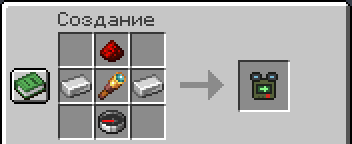
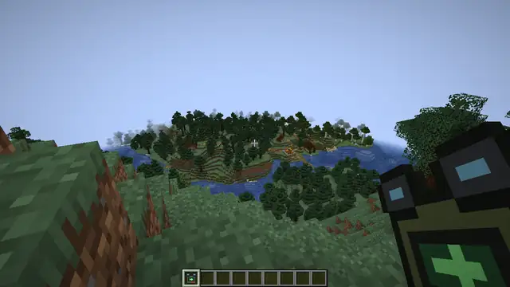
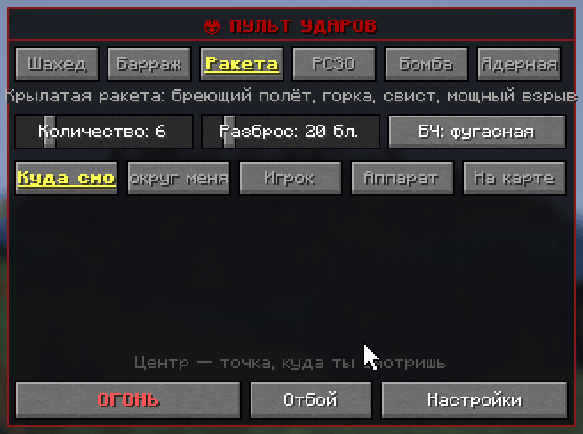
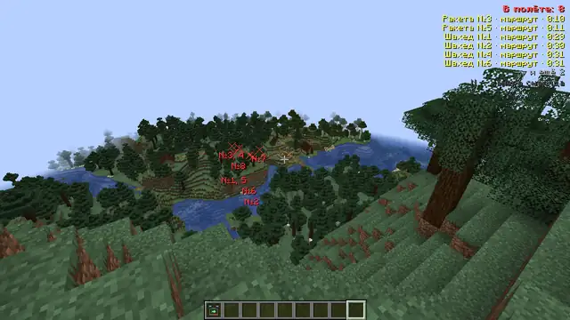

# Пульт наведения

Пульт наводит и пускает все удары: из бинокля, с экрана пульта или с [карты](map.md).

## Как получить

Крафт: сверху красная пыль, в середине железный слиток, подзорная труба и железный слиток, снизу компас.

В творческом режиме пульт лежит во вкладке «Airstrike». Если хозяин мира разрешил пульт только операторам, остальным
он не стреляет.

## Бинокль

- **ПКМ (держать)** — бинокль. Под прицелом видно, что это и как далеко. Захватил моба, игрока или аппарат — пульт
  пищит.
- **Колесо мыши** — оружие: Шахед, Барраж, Ракета, РСЗО, Бомба, Ядерная.
- **ЛКМ** — пуск.

Бинокль достаёт на 400 блоков, дальше бей [по карте](map.md). Ядерный пуск идёт после отсчёта 3 секунды, повторный
ЛКМ его отменяет.

## Экран пульта

Shift+ПКМ с пультом в руке. Здесь выбирают, сколько снарядов пустить, как широко их раскидать и куда. Бинокль потом
стреляет с этими же настройками.

- **Оружие** — шесть кнопок, у каждой подсказка. У ракеты и бомбы рядом кнопка ядерной боевой части.
- **Количество и разброс** — до 30 снарядов на площади до 150 блоков от центра.
- **Цель**: «Куда смотрю», «Вокруг меня» (туда, где стоишь, так что отойди), «Игрок» (только
  [замеченные](rules.md#разведка)), «Аппарат» (летательные аппараты Create рядом), «На карте».
- **ОГОНЬ**, **Отбой** и **Настройки**.

## Снаряды на экране

Пока твои снаряды летят, справа вверху виден их список с этапом полёта и временем до удара, а в мире над каждым
снарядом метка с номером и пунктир к цели.

## Отбой

Кнопка «Отбой» на экране пульта отменяет **твои** удары: снаряды самоликвидируются в воздухе без взрыва, B-2
отворачивает, невыпущенные снаряды залпа возвращаются в инвентарь. Ядерный удар, летящий «Град» и сброшенная бомба
долетят.
