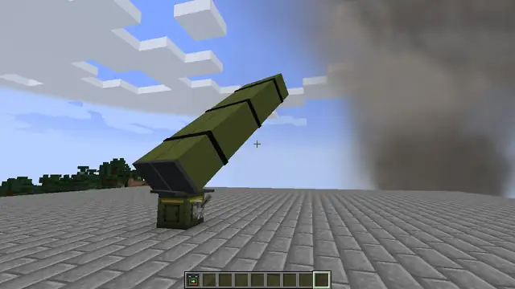

# Стационарная пусковая

Блок, который сам пускает шахеды, «Ланцеты», крылатые ракеты и «Град» по сигналу редстоуна. Цель задаёт пульт,
огонь даёт кнопка, рычаг или любая схема. Несколько пусковых — батарея на одну кнопку.

## Как зарядить

Ставь на открытом месте: постройки перед пакетом закрывают пуск. Боеприпасы кладут правым кликом или воронкой
(и через неё — механизмами Create), в запасе 9 ячеек. Вынуть их можно, только сломав блок. B-2 и МБР с неё
не пускаются.

## Задача

1. ПКМ пультом по пусковой — привязать её к пульту (ещё раз — отвязать).
2. Выбери в пульте цель, оружие и залп и дай «Огонь»: пока к пульту привязаны пусковые, он не стреляет сам,
   а ставит им задачу. Кнопка огня на экране пульта называется «ЗАДАЧА».
3. Пусковая разворачивается к цели и ждёт сигнала.

Цель задачи — место не дальше 10 000 блоков от пусковой: игрок или аппарат становятся местом, где были в этот
момент. Привязать можно только свою пусковую или пусковую своей команды (`/team`). Чтобы пульт снова стрелял сам,
отвяжи все пусковые.

## Огонь

Каждый новый сигнал редстоуна — один приказ: снаряд или весь залп задачи. Снаряды летят от имени хозяина пусковой,
даже если его нет в сети, и «Отбой» на его пульте их отзывает. Пусковая стреляет, только пока загружен её чанк,
и не стреляет с летательного аппарата.

Если пусковая щёлкает и не стреляет, ПКМ по ней пустой рукой покажет причину: нет задачи, мало запаса, идёт прошлый
приказ или сектор закрыт постройками.

## Крафт

Без Create точный механизм в рецепте заменяют часы.
