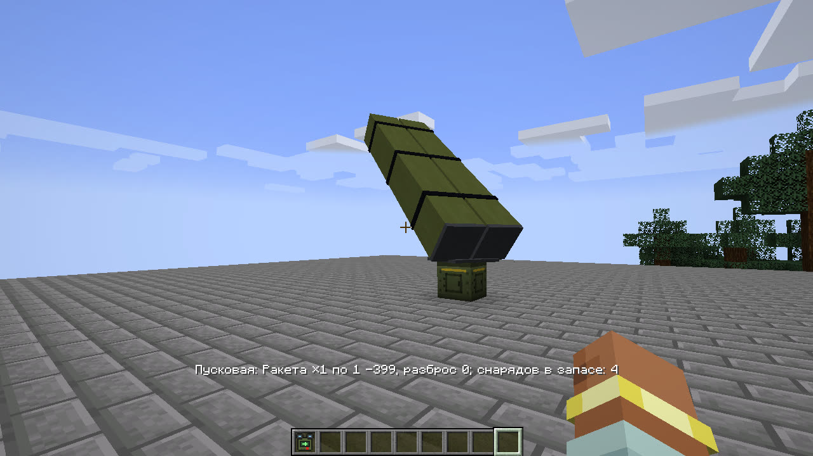
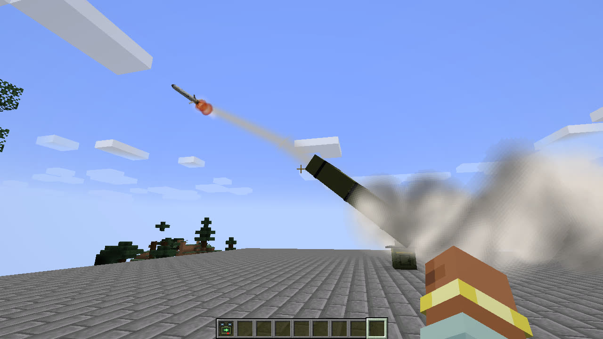
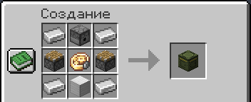

# Стационарная пусковая

Стационарная пусковая установка — блок, который сам пускает шахеды, «Ланцеты», крылатые ракеты и «Град» по сигналу
редстоуна. Цель и оружие ей задаёт пульт, а огонь даёт кнопка, рычаг или любая схема. Из нескольких пусковых
получается батарея, которая стреляет по одной кнопке или сама, по сигналу с завода.

## Как поставить и зарядить

- Ставь пусковую на открытом месте. Над блоком на поворотном круге стоит пакет того оружия, которое ей задано,
  в настоящую величину (контейнеры крылатых ракет длиной 7 метров). Постройки перед пакетом закрывают сектор пуска,
  как у [мобильной пусковой](weapons.md#если-пусковой-негде-встать).
- Боеприпасы кладут правым кликом, воронкой или воронкой и жёлобом Create. Механическая рука и лента Create кладут
  через воронку. В запасе 9 ячеек.
- Пусковая берёт шахеды, «Ланцеты», крылатые ракеты и пакеты «Града». B-2 и МБР с неё не пускаются, ядерную боевую
  часть она не берёт.
- Вынуть боеприпасы можно, только сломав блок: тогда запас выпадает вместе с ним.
- Компаратор показывает, насколько полон запас.
- ПКМ пустой рукой показывает задачу, запас и чем кончился последний сигнал.

## Задача

Задачу пусковой ставит [пульт](designator.md):

1. ПКМ пультом по пусковой привязывает её к пульту, повторный ПКМ отвязывает. К одному пульту можно привязать
   до 16 пусковых.
2. Пока к пульту привязана хоть одна пусковая, сам пульт не стреляет. «Огонь» в бинокле, на карте или на экране пульта
   ставит задачу привязанным пусковым. В бинокле в это время написано «ЛКМ — задача привязанным пусковым», а кнопка
   огня на экране пульта называется «ЗАДАЧА».
3. Задача — то, что выбрано в пульте: цель, оружие, число снарядов, разброс и точки маршрута с карты.

Что важно знать:

- Цель задачи — место. Игрок, моб или летательный аппарат становятся местом, где они были в момент задачи.
  По игроку и чужому аппарату действуют те же [правила разведки](rules.md#разведка), что и для пульта.
- Цель должна быть не дальше дальности карты (10 000 блоков) от самой пусковой, а маршрут должен укладываться в запас
  хода оружия от неё.
- Получив задачу, пусковая разворачивает пакет к цели. Пока идёт прошлый приказ, задача не меняется.
- Задачу получают только пусковые в загруженных чанках. Над хотбаром видно, скольким пусковым она передана.
- Привязать и задать можно свою пусковую или пусковую своей команды (`/team`).
- Сломанная пусковая отвязывается от пульта при следующем «Огне». Чтобы пульт снова стрелял сам, отвяжи все пусковые.

## Огонь

Каждый новый сигнал редстоуна — кнопка, рычаг, наблюдатель, механизмы Create — даёт один приказ по задаче: один
снаряд или весь залп. Сигнал пусковая принимает, как раздатчик.

- Снаряды летят от имени того, кто поставил пусковую, даже если его нет в сети. Для ЗРК и `/team` они его,
  а «Отбой» на его пульте их отзывает. Если хозяин мира ограничил число снарядов в полёте у одного игрока
  (`launch.max_active_per_player`), они идут в счёт хозяина пусковой.
- Боеприпасов в запасе должно хватать на весь приказ. Снимаются они по одному, когда снаряд встаёт на направляющую,
  поэтому невыпущенное из отменённого залпа остаётся в запасе.
- Если пуска нет, пусковая щёлкает, как пустой раздатчик. Причину видно по ПКМ пустой рукой: нет задачи, не хватает
  запаса, идёт прошлый приказ или сектор закрыт постройками.
- Пусковая стреляет, только пока загружен её чанк. На летательном аппарате она не стреляет.

## Крафт

Сверху железный слиток, раздатчик и железный слиток; в середине поршень, точный механизм Create (без Create — часы)
и поршень; снизу железный слиток, блок железа и железный слиток.

Оператор может управлять пусковой и командой, см. [команды](commands.md#стационарная-пусковая).
