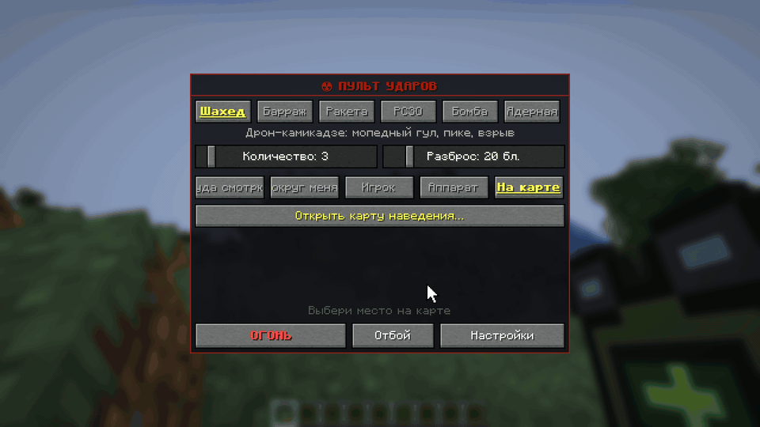

# Карта наведения

Карта бьёт по любому месту до 10 000 блоков: за холм, в соседний город. Открывается клавишей `,` или с экрана пульта
(цель «На карте» → «Открыть карту наведения…»).

| Действие | Клавиша |
|---|---|
| выбрать место или чужого игрока | ЛКМ |
| сдвинуть карту / приблизить | тянуть ЛКМ / колесо мыши |
| вернуться к себе | пробел |
| поставить точку маршрута (до пяти) | Shift+ЛКМ |
| сдвинуть / убрать точку | тянуть точку / ПКМ по ней |
| огонь | Enter или «ОГОНЬ» |
| назад к пульту | Esc |

Удар идёт с оружием, числом снарядов и разбросом [экрана пульта](designator.md#экран-пульта). На карте видны твои
снаряды в полёте, игроки своей команды и чужие там, где их [видели](rules.md#разведка) последний раз.

## Маршрут

Шахед, крылатая ракета и «Ланцет» летят через точки маршрута: в обход ЗРК или чтобы зайти с нужной стороны. Внизу
видно длину маршрута и время полёта. Слишком длинный маршрут краснеет, и огонь не даётся. Без точек снаряд выбирает
путь сам. Остальное оружие маршрут не берёт.

## Если карта пустая

Без Distant Horizons карта показывает только загруженные чанки, но ударить по пустому месту всё равно можно. В Незере
карта не работает.
