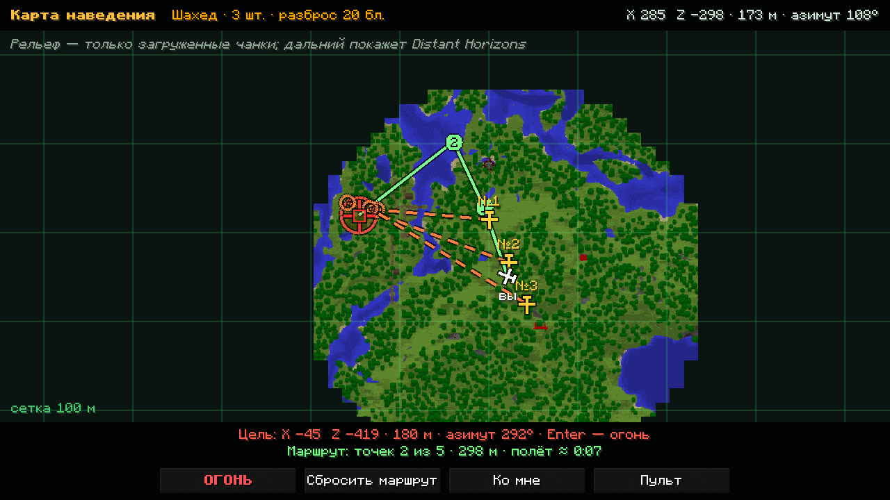
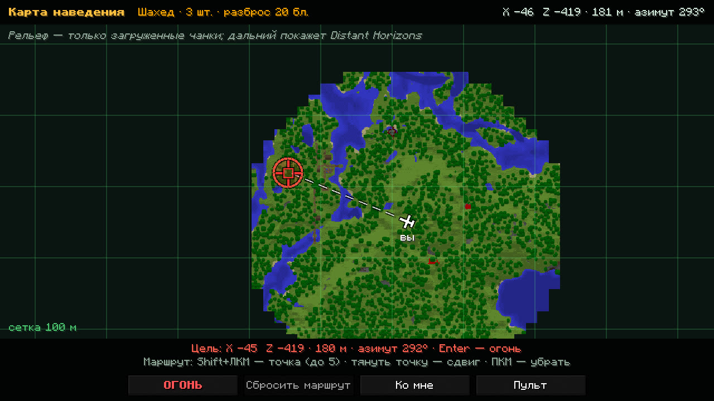
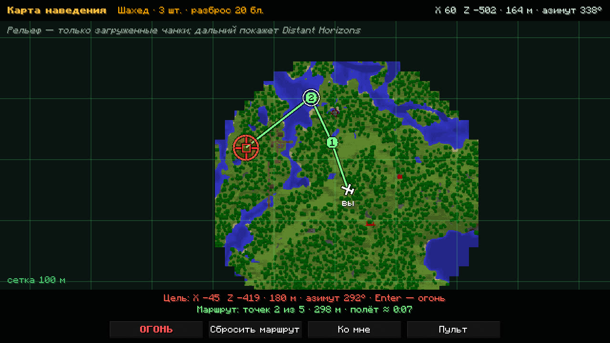

# Карта наведения

Карта бьёт по любому месту в своём измерении на расстоянии до 10 000 блоков: туда, куда не достаёт бинокль, за холм,
в соседний город. Открывается клавишей `,` или с экрана пульта: режим цели «На карте», кнопка «Открыть карту
наведения…».

## Что на карте

Север сверху. Рельеф с городами и дорогами, сетка с подписью шага («сетка 100 м»), ты («вы») и куда смотришь. Ещё
на карте видно:

- свои снаряды в полёте, их путь к цели и прицел у цели; кто за краем карты, тот стрелкой у края;
- игроков: своих по команде всегда, чужих там, где их видели последний раз, с давностью в секундах
  (подробно — [разведка](rules.md#разведка));
- выбранную цель, перекрестие, линию от тебя и круг разброса залпа.

Сверху написаны выбранное оружие и залп, справа вверху — координаты под курсором.

С модом Distant Horizons карта показывает рельеф на километры вокруг. Без него — только загруженные чанки, а дальше
пусто, но ударить туда всё равно можно. В Незере карта не работает: она видит только потолок.

## Как ударить

| Действие | Клавиша |
|---|---|
| выбрать место или чужого игрока | ЛКМ |
| сдвинуть карту | тянуть ЛКМ |
| приблизить и отдалить | колесо мыши |
| вернуться к себе | пробел или кнопка «Ко мне» |
| огонь | Enter или кнопка «ОГОНЬ» |
| назад к экрану пульта | Esc или кнопка «Пульт» |

Удар идёт с настройками пульта: оружие, число снарядов и разброс выбираются на [экране пульта](designator.md#экран-пульта).
Под картой видно выбранное место: координаты, расстояние от тебя и азимут, например
«X 1200 Z −340 · 2.40 км · азимут 135°». Высоту земли в этом месте сервер находит сам, даже если там ещё никто
не был.

Клик по значку чужого игрока делает целью его. Бить по нему можно, только пока его видишь ты или твоя команда,
или по месту, где его видели недавно.

## Маршрут

Шахед, крылатая ракета и «Ланцет» могут лететь по маршруту: в обход ЗРК, вдоль реки, чтобы зайти с нужной стороны.

| Действие | Клавиша |
|---|---|
| поставить точку (до пяти) | Shift+ЛКМ |
| сдвинуть точку | тянуть точку |
| убрать точку | ПКМ по точке |
| убрать все | кнопка «Сбросить маршрут» |

Линия идёт от тебя через точки к цели. Под картой видно длину маршрута и примерное время полёта. Шахед и ракета
пролетают по маршруту до 30 км, «Ланцет» до 15 км. Если маршрут длиннее, линия краснеет, а огонь не даётся.

Весь залп летит одним маршрутом. Маршрут помнится, пока ты в мире, так что удар можно повторить. Без точек снаряд
выбирает путь сам. РСЗО, B-2 и МБР маршрут не берут: линия бледная, они летят к цели сами. Линию маршрута видишь
только ты.
