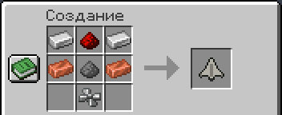
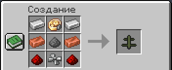
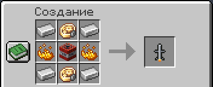
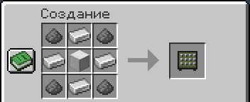
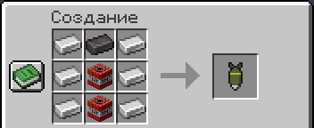
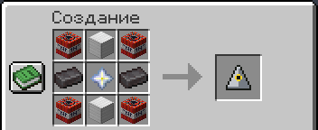
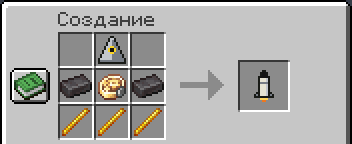

# Боеприпасы и крафт

Пульт пускает только то, что лежит в инвентаре. Каждый снаряд — скрафченный предмет: один шахед, «Ланцет», ракета,
бомба или МБР — один предмет. «Град» — пакет на 40 снарядов, как полная перезарядка пусковой: залп тратит из него
по снаряду, остаток видно полоской на предмете.

## Как платится пуск

- Приказ оплачивается сразу и целиком: и одиночный пуск, и весь залп.
- Если боеприпасов меньше, чем нужно, пуска нет. Над хотбаром пишется, сколько нужно и сколько есть.
- Если пуск не удался, боеприпас возвращается в инвентарь.
- Если залп отменён [отбоем](designator.md#отбой), невыпущенные снаряды возвращаются владельцу, пока он в игре.
  Полный инвентарь — падают к ногам. Если владелец погиб и ещё не возродился, они лежат на месте гибели. Игроку
  не в сети не возвращаются.
- Снаряд, который уже стоит на пусковой, считается выпущенным.
- Ядерная боевая часть на крылатой ракете или бомбе — ещё один предмет, «Ядерная боевая часть». МБР уже ядерная.
- В творческом режиме, у оператора в командах, из консоли и командного блока боеприпасы не нужны.

## Рецепты

Все рецепты — на верстаке. Механический крафтер Create собирает их так же, поэтому боеприпасы можно делать
на заводе. В игре рецепт любого предмета показывает JEI (в сборке он есть): наведи на предмет и нажми `R`.

В «мозгах» управляемого оружия стоит точный механизм Create, а в шахеде и «Ланцете» винт — пропеллер Create. Если
Create не установлен, вместо механизма идут часы, вместо пропеллера — железный люк.

| Боеприпас | Рецепт |
|---|---|
| **Шахед-136** — железо, красная пыль, медь, порох, пропеллер |  |
| **Барражирующий «Ланцет»** — железо, точный механизм, медь, порох, красная пыль, пропеллер |  |
| **Крылатая ракета** — железо, два точных механизма, огненный порошок, ТНТ |  |
| **Пакет ракет «Град»** (40 снарядов) — порох, железо, блок железа |  |
| **Бетонобойная бомба** — железо, незеритовый слиток, два ТНТ |  |
| **Ядерная боевая часть** — ТНТ, блоки железа, незеритовые слитки, звезда Незера |  |
| **МБР** — ядерная боевая часть, незеритовые слитки, точный механизм, огненные стержни |  |

Рецепты можно поменять датапаком мира: они лежат в `data/airstrike/recipe`.

## Другие предметы мода

| Предмет | Где |
|---|---|
| Пульт наведения | [рецепт](designator.md#как-получить) |
| Зенитный ракетный комплекс и зенитные ракеты | [рецепты](defense.md#крафт-и-зарядка) |
| Трансформаторная подстанция | [рецепт](blackout.md) |
| Счётчик Гейгера | рецепта нет: творческий режим или выдаёт оператор (`/give @s airstrike:geiger_counter`) |
