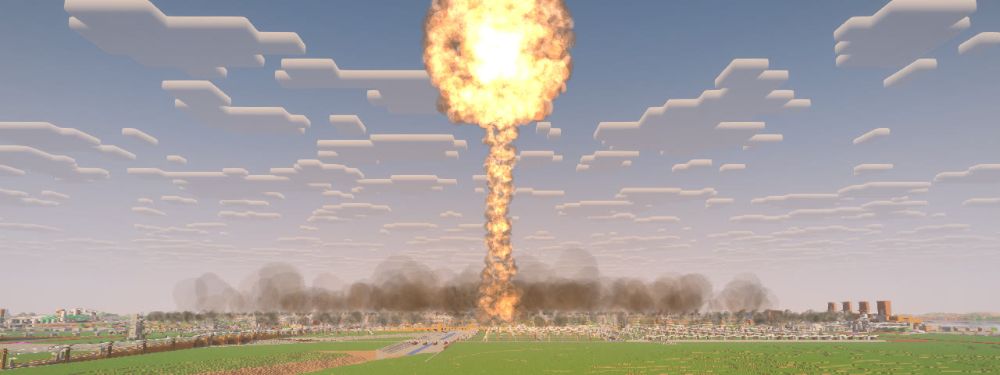
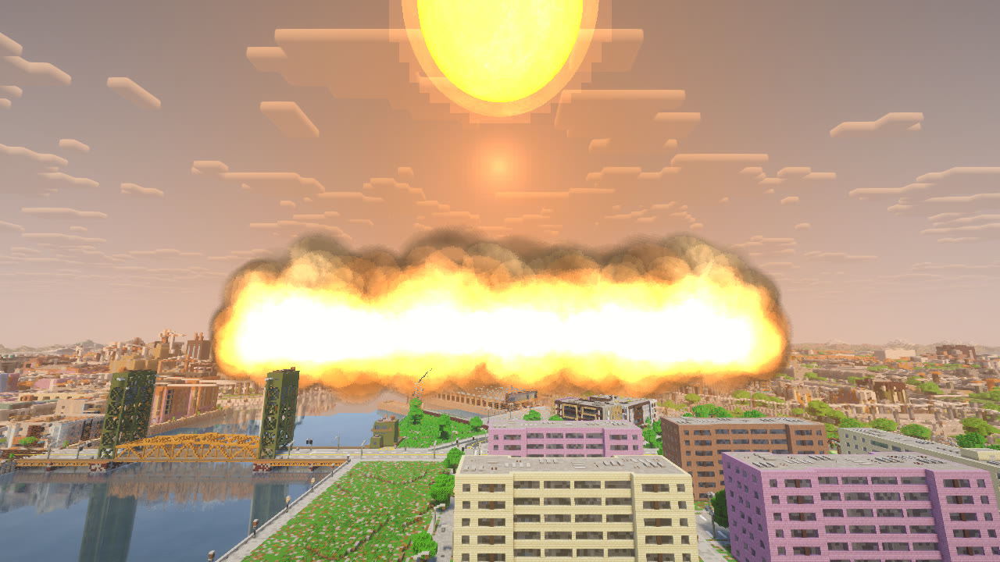
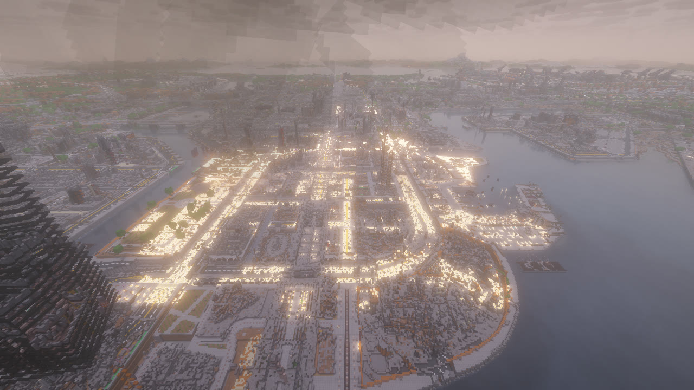

# Ядерный удар

Ядерная боевая часть мощностью 1 или 15 кт на межконтинентальной ракете (МБР), крылатой ракете или бомбе B-2.
Вспышка, огненный шар, гриб высотой до 12 км, ударная волна, пожары, а при наземном подрыве — воронка
и радиоактивный след. Радиусы взяты из справочника «The Effects of Nuclear Weapons» (Glasstone, Dolan),
блок равен метру.

## Кто может пустить

По умолчанию ядерное оружие только у операторов (настройка мира `nuclear.ops_only`). Если хозяин мира её выключил,
пустить может любой игрок, но по правилам ниже. Оператору, хосту, консоли и командному блоку эти правила не нужны.

## Как пустить

1. **Боеприпас.** Предмет «МБР» или носитель (крылатая ракета, бетонобойная бомба) плюс предмет «Ядерная боевая
   часть». Рецепты — в разделе [Боеприпасы](munitions.md#рецепты).
2. **Выбор на экране пульта.** Оружие «Ядерная» для МБР или ракета и бомба с кнопкой «БЧ: ☢ ядерная». Мощность:
   1 кт («тактическая») или 15 кт («Хиросима»). Подрыв: воздушный (больше площадь разрушений, почти без осадков)
   или наземный (воронка, тринитит и радиоактивный след с чёрным дождём). У бомбы подрыв всегда под землёй после
   бурения.
3. **Пуск.** ЛКМ в бинокле или «ОГОНЬ». Идёт отсчёт «☢ ПУСК ЧЕРЕЗ 3», ещё один ЛКМ отменяет.

МБР стартует в 30 блоках позади тебя и летит 90 секунд. Вверху экрана идёт отсчёт «☢ МБР в полёте · 15 кт · подрыв
через N с».

### Правила для игрока без прав оператора

Действуют, только если `nuclear.ops_only` выключена:

- **Второй ключ.** Если в игре есть кто-то ещё, пуск ждёт второго ключа. Другой игрок не дальше 16 блоков от тебя
  нажимает клавишу «Второй ключ» (`.`) за 30 секунд. Всем, кто рядом, приходит строка: кто запускает, чем, куда
  и какой клавишей подтвердить. Нет ключа — пуск отменяется, боеприпасы возвращаются. Один в игре — ключ не нужен.
- **Тревога заранее.** До удара не меньше 90 секунд тревоги у цели. МБР летит не меньше 90 секунд, а носитель
  стартует через 90 секунд после объявления тревоги.
- **Пуск видят все.** Каждому игроку приходит «☢ Обнаружен пуск МБР из района X, Z» (с точностью до 256 блоков)
  и звучит сирена.
- **Отменить нельзя.** Свой ядерный удар не отменить и не перенацелить. Снять его может только оператор.

## Что видно и слышно

- **Тревога.** Всем ближе 20 км к цели воет сирена гражданской обороны, на экране «☢ РАКЕТНОЕ НАПАДЕНИЕ ☢» и «До
  удара N с — в укрытие, под землю».
- **Вспышка.** Свет приходит сразу: двойная вспышка, огненный шар, потом гриб.

- **Ударная волна** идёт от центра стеной пыли и огня. Вдали она медленнее настоящей, чтобы её было видно: до 1 км
  доходит примерно за 8 секунд, до 2 км — за 25. Волна ломает постройки в момент прихода, валит деревья, начинаются
  пожары. Рядом с эпицентром глохнешь и звенит в ушах.

- **Наземный подрыв** роет воронку с тринититом и оставляет радиоактивный след по ветру. В следе идёт чёрный
  дождь, небо и туман бурые.

## Радиусы

Расстояние от эпицентра по земле, воздушный подрыв (по умолчанию):

| Что | 1 кт | 15 кт |
|---|---|---|
| волна убивает | 0,16 км | 0,4 км |
| тяжёлые разрушения | 0,37 км | 0,9 км |
| свет убивает того, кто видит шар | 0,46 км | 1,9 км |
| ожоги | 0,9 км | 3,4 км |
| смертельная доза радиации сразу | 0,7 км | 1,1 км |
| выбиты окна | 2,4 км | 6 км |

У наземного подрыва волна и разрушения достают дальше (15 кт: 0,7 и 1,1 км), свет ближе, и добавляются воронка
и радиоактивный след. В маленьких мирах хозяин мира может уменьшить все радиусы настройкой `nuclear.effects_scale`.

## Как выжить

- **Под землю.** Волна не трогает природный грунт: горы, скалы, пещеры и бункеры стоят. Земля, крыша и стены
  ослабляют и свет, и радиацию, а под крышей и без прямой видимости волна бьёт втрое слабее.
- **Не смотреть на шар.** Свет убивает и обжигает только тех, кто под открытым небом видит огненный шар.
- **Успеть за секунды.** Увидел вспышку вдали — до прихода волны есть время нырнуть за склон, в подвал или в яму.
- **Уйти из следа.** В следе наземного подрыва облучение копится, пока ты там. Пыль на одежде смывает вода
  (дождь не смывает).
- **Лучевая болезнь** начинается через игровые часы после облучения: слабость, потом разгар. Молоко её не лечит.
  От 6 Гр смерть неизбежна, от 4 Гр возможна.

Игровые часы осадков: 1000 тиков (50 секунд) — один час.

## Счётчик Гейгера

В руке щёлкает и показывает над хотбаром мощность дозы, например «☢ 120 мкЗв/ч». Рецепта нет: он есть в творческом
режиме, в выживании его выдаёт оператор. Накопленную дозу игрока оператор смотрит командой `/airstrike radiation`.
