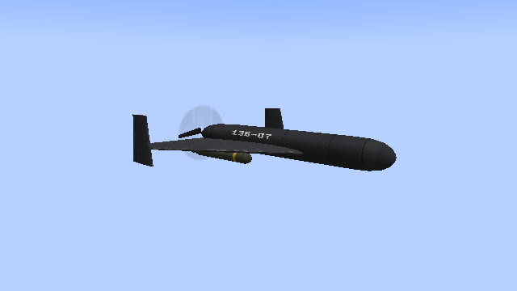
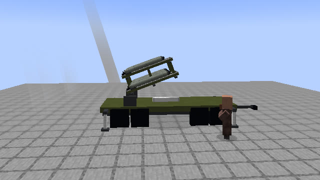
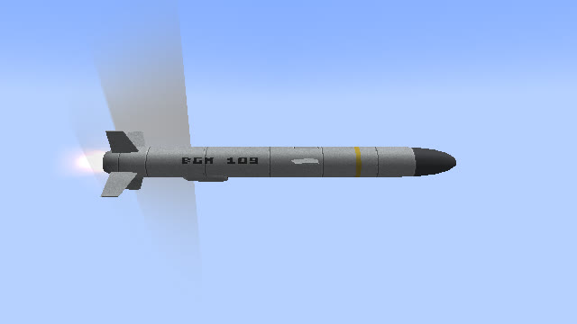
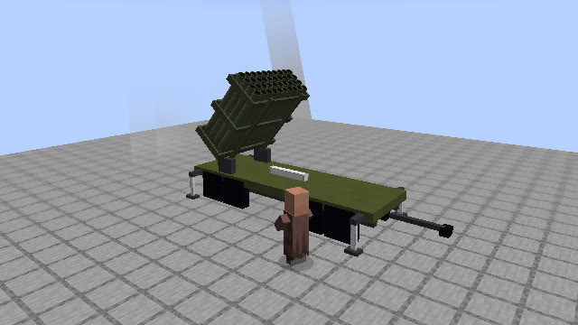
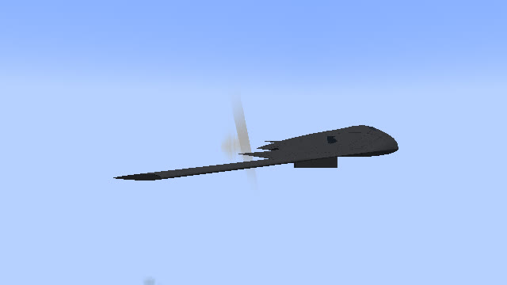
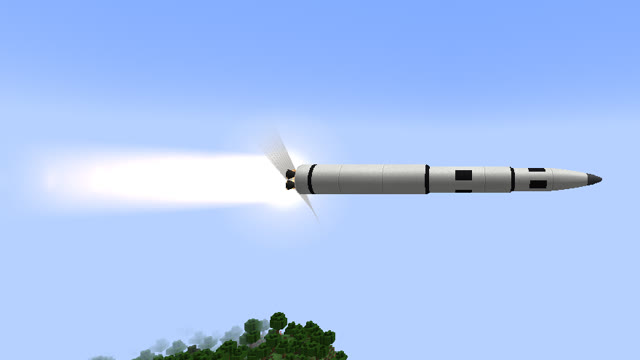

# Оружие

Шесть видов оружия, в пульте и в бинокле они идут в таком порядке: Шахед, Барраж, Ракета, РСЗО, Бомба, Ядерная.
Каждый пуск тратит [боеприпас](munitions.md) из инвентаря.

| | Шахед | Барраж («Ланцет») | Ракета | РСЗО («Град») | Бомба (B-2) | Ядерная (МБР) |
|---|---|---|---|---|---|---|
| Скорость | ≈150 км/ч | ≈115 км/ч, в пике ≈290 | ≈290 км/ч | по баллистике | B-2 ≈860 км/ч | до 1800 км/ч на разгоне |
| До удара | ≈50 с | подлёт и 25 с круга | ≈30 с | 7–10 с | ≈40 с до сброса | 90 с |
| Откуда | пусковая рядом с тобой | катапульта рядом с тобой | пусковая рядом с тобой | прицеп рядом с тобой | издалека | в 30 блоках позади тебя |
| Промах | 3–4 блока | нет | ≈2 блока | 1 % дальности | ≈2 блока | нет |
| За движущейся целью | да, через камеру | да, через камеру | нет | нет | нет | нет |
| Маршрут по карте | до 30 км | до 15 км | до 30 км | нет | нет | нет |
| Сирена у цели | за 25 с | за 20 с | за 15 с | за 8 с | за 20 с | за 90 с |
| Сбивает ЗРК | да | да | да | нет | да | нет |
| Сила взрыва (ТНТ = 4) | 12 | 8 | 20 | 7 на снаряд | 20, под землёй | ядерный, 1 или 15 кт |
| Выбивает окна до | ~70 блоков | ~30 блоков | ~150 блоков | ~40 блоков | — | километры |

Время до удара указано для близкой цели, до далёкой дольше. Силу взрыва и время полёта хозяин мира может
поменять в настройках.

## Шахед

Дрон-камикадзе в духе «Шахеда-136». Рядом с тобой разворачивается прицеп с рамой на пять шахедов, ускоритель
сбрасывает дрон с направляющей, и он уходит, громко тарахтя мотором. Летит не по прямой, а в обход, и заходит
на цель с твоей стороны. В конце пикирует.

Когда брать: по постройкам и по движущимся целям. Пока держишь цель в кадре [камеры](camera.md#движущаяся-цель),
шахед идёт за ней. Его долго слышно на подлёте, и его сбивает ЗРК, поэтому против обороны их пускают залпом
или по [маршруту](map.md#маршрут) в обход.

## Барраж («Ланцет»)

Маленький электрический дрон с двумя крестами крыльев. Стартует с катапульты, летит к цели и кружит над ней
в 45 блоках выше. Через 25 секунд пикирует сам, а из камеры цель можно выбрать раньше: наведи прицел и нажми ЛКМ.
У каждого «Ланцета» в рое свой круг и своё время.

Когда брать: когда нужна точность. Цель выбираешь глазами с круга, промаха нет. Взрыв небольшой: по технике,
по игроку в поле, по отдельному дому. Подробно — [камера «Ланцета»](camera.md#ланцет-выбор-цели).

## Крылатая ракета

Стартует из контейнера на пусковой рядом с тобой, после ускорителя раскрывает крылья и идёт низко над рельефом,
облетая мачты и высокие дома. Перед целью делает горку и пикирует. Летит втрое медленнее настоящей, чтобы подлёт
было видно.

Когда брать: мощный и быстрый удар по неподвижной цели. За движущейся целью ракета не идёт: бьёт туда, где цель
была в момент пуска. Может нести ядерную боевую часть (кнопка «БЧ» на экране пульта, нужен предмет «Ядерная боевая
часть»).

Цель за крутым холмом или на дне глубокого карьера ракета на атаке может не облететь и задеть склон. Тогда бей
бомбой или шахедом.

## РСЗО («Град»)

Прицеп с пакетом из 40 труб, как у «Града». Пакет доворачивается на цель, снаряды сходят очередью по полсекунды
и летят по баллистике, без наведения. Пульт по умолчанию ставит очередь из 12 снарядов с разбросом 15 блоков;
поменять можно на экране пульта.

Когда брать: накрыть площадь множеством небольших взрывов. ЗРК «Град» не сбивает, а сирена у цели включается всего
за 8 секунд. Разброс растёт с дальностью, 1 % от неё: на 500 блоков это около 5 блоков, сверх разброса залпа.

## Бомба (B-2)

Бомбардировщик B-2 появляется издалека на боевом курсе, открывает бомболюк и сбрасывает бетонобойную бомбу. Она
пробивает около 30 блоков камня и взрывается под землёй: рушит бункер, обрушивает свод пещеры, выбрасывает газы.
Сам самолёт не нужен, только бомба.

Когда брать: по подземным базам и бункерам. B-2 малозаметен: радар ЗРК видит его гораздо ближе, чем шахед.
Может нести ядерную боевую часть, тогда бомба рвётся под землёй после бурения.

## Ядерная (МБР)

Межконтинентальная ракета стартует в 30 блоках позади тебя, уходит вверх, и через 90 секунд её боевая часть
подрывается над целью или у земли. Мощность 1 или 15 кт. Всё про пуск, взрыв, радиацию и укрытие — в разделе
[Ядерный удар](nuke.md).

## Если пусковой негде встать

Пусковая встаёт рядом с тобой, на свободном месте с открытым курсом. Если вокруг тесно (высотки, лес), пульт
пишет «Пусковую негде поставить: по курсу пуска постройки. Заход издалека.», и снаряд прилетает издалека, как B-2.
Отойди на открытое место, если хочешь видеть пуск.
